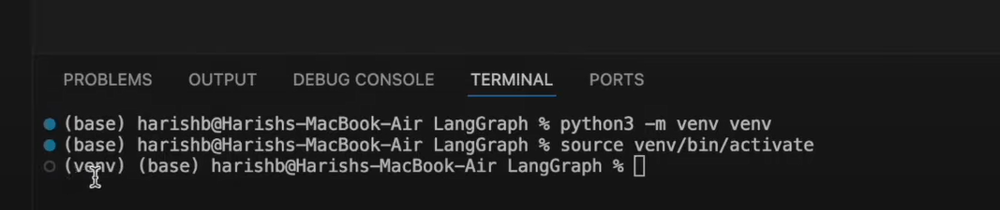

# Sen-Social: AI Space News Reporter Agent

An AI-powered social media agent that generates engaging space exploration news posts using a reflection-based improvement loop. The agent searches for current space news, generates posts, gets feedback, and iteratively improves the content.

## 🌟 Features

- **Tool-Enabled Agent**: Uses Tavily search to fetch latest space exploration news
- **Time-Aware**: Gets current date/time for contextual posts
- **Reflection Loop**: Automatically critiques and improves generated content
- **Space-Focused**: Specialized in NASA Artemis missions and space exploration news
- **Viral Optimization**: Optimized for engagement, brevity, and impact

## 🏗️ Architecture

### Core Components

- **`tools.py`**: Defines search and time tools
- **`chains.py`**: Sets up LLM chains for generation and reflection
- **`simple_reflect_agent.py`**: Simple loop implementation
- **`reflect_agent.py`**: LangGraph-based implementation with visual workflow

### Key Files

```
sen-social/
├── tools.py              # Search and time tools
├── chains.py              # LLM chains and prompts
├── simple_reflect_agent.py  # Simple loop implementation
├── reflect_agent.py       # LangGraph workflow implementation
├── .env                   # API keys
└── README.md
```

## 🚀 Setup

### Environment Setup

```bash
# Create virtual environment
python3 -m venv venv
source venv/bin/activate  # On Windows: venv\Scripts\activate

# Install dependencies
pip install grandalf
pip install langgraph
pip install langchain
pip install langchain-openai
pip install langchain-community
pip install tavily-python
pip install python-dotenv
```

### API Keys

Create a `.env` file with:

```env
OPENAI_API_KEY=your_openai_api_key
TAVILY_API_KEY=your_tavily_api_key
LANGSMITH_TRACING=true
LANGSMITH_ENDPOINT=https://api.smith.langchain.com
LANGSMITH_API_KEY=your_langsmith_api_key
LANGSMITH_PROJECT=sen-social
```

## 🎯 Usage

### Simple Generation-Reflection Loop (Recommended)

```bash
python simple_reflect_agent.py
```

This will:
1. Search for latest NASA Artemis mission news
2. Generate an initial social media post
3. Critique the post for improvements
4. Generate an improved version
5. Repeat for 3 iterations total

### LangGraph Workflow Implementation

```bash
python reflect_agent.py
```

This provides:
- Visual workflow representation with Mermaid diagrams
- Graph-based state management
- Same generation-reflection logic in a more structured format

### Custom Usage

```python
# Simple approach
from simple_reflect_agent import simple_generation_reflection_loop

final_post = simple_generation_reflection_loop(
    "Latest news about SpaceX Dragon mission",
    max_iterations=2
)
print(final_post)
```

```python
# LangGraph approach
from reflect_agent import app
from langchain_core.messages import HumanMessage

response = app.invoke(HumanMessage(content="Your space news query"))
```

## 🔧 Configuration

### Prompt Customization

Edit `chains.py` to modify:
- `GENERATION_PROMPT_FIRST`: Initial generation instructions
- `GENERATION_PROMPT_ADJUSTMENTS`: Refinement instructions
- `reflection_prompt`: Critique criteria

### Tool Configuration

In `tools.py`:
- Modify search depth: `TavilySearchResults(search_depth="basic")`
- Adjust time format: `get_system_time(format="%Y-%m-%d %H:%M:%S")`

## 🧠 How It Works

### Simple Implementation (`simple_reflect_agent.py`)
1. **Search Phase**: Agent uses Tavily to find current space exploration news
2. **Generation Phase**: Creates engaging social media post with current information
3. **Reflection Phase**: Critiques post for brevity, impact, and virality
4. **Improvement Phase**: Generates refined version based on feedback
5. **Iteration**: Repeats reflection and improvement for better results

### LangGraph Implementation (`reflect_agent.py`)
1. **Visual Workflow**: Displays the generation-reflection process as a graph
2. **State Management**: Uses LangGraph's state management for message history
3. **Node-based Processing**: Separate nodes for generation and reflection
4. **Conditional Routing**: Automatically determines when to stop the loop
5. **Graph Visualization**: Shows workflow structure with Mermaid diagrams

## 📊 Example Output

### Simple Reflect Agent
```
--- Iteration 1 ---
🤖 Generating initial post...
📝 Generated Post:
🚀 Exciting Updates on NASA's Artemis Mission! 🌕
...

🧠 Getting feedback...
💭 Feedback:
The post is informative but could be more engaging...

--- Iteration 2 ---
🤖 Generating improved post based on feedback...
📝 Generated Post:
🚀 BREAKING: NASA delays Artemis II to April 2026! 
Here's what this means for lunar exploration... 🌕
...
```

### LangGraph Reflect Agent
```
🔄 LangGraph Reflection Agent
📊 Graph Structure:
graph TD
    GENERATE --> REFLECT
    REFLECT --> GENERATE
    GENERATE --> END

🚀 Starting generation-reflection loop...
🎉 Final Result:
📝 Final Post:
🚀 BREAKING: NASA delays Artemis II to April 2026! 
...
```

## 🎨 Inspiration

- [YouTube Tutorial](https://www.youtube.com/watch?v=Y3dbzuQBnUw)
- [GitHub Reference](https://github.com/harishneel1/langgraph/blob/main/)

## 📈 Architecture Diagram



## 🛠️ Technologies

- **LangChain**: LLM framework and prompt management
- **LangGraph**: Agent workflow orchestration
- **OpenAI GPT-4**: Core language model
- **Tavily**: Real-time web search
- **Python**: Implementation language